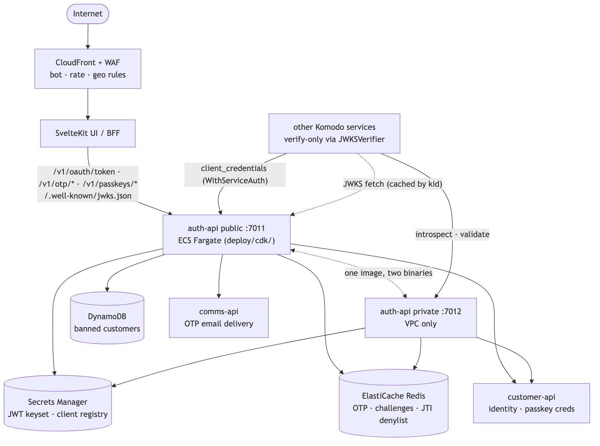
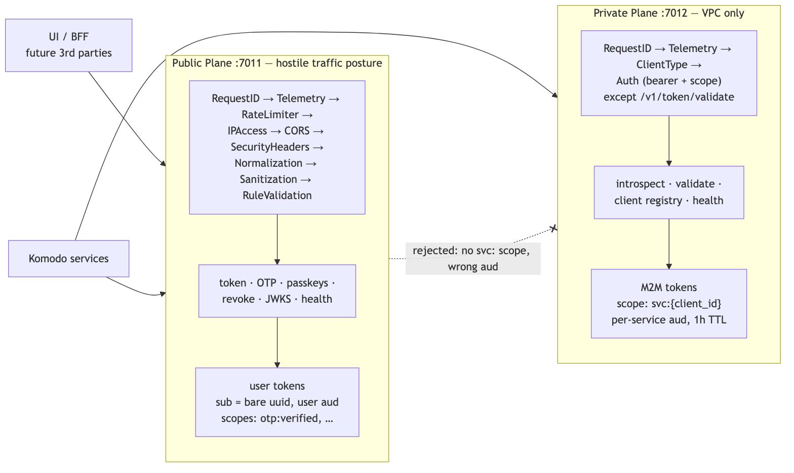
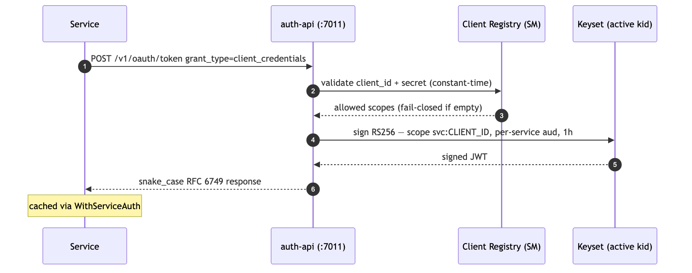
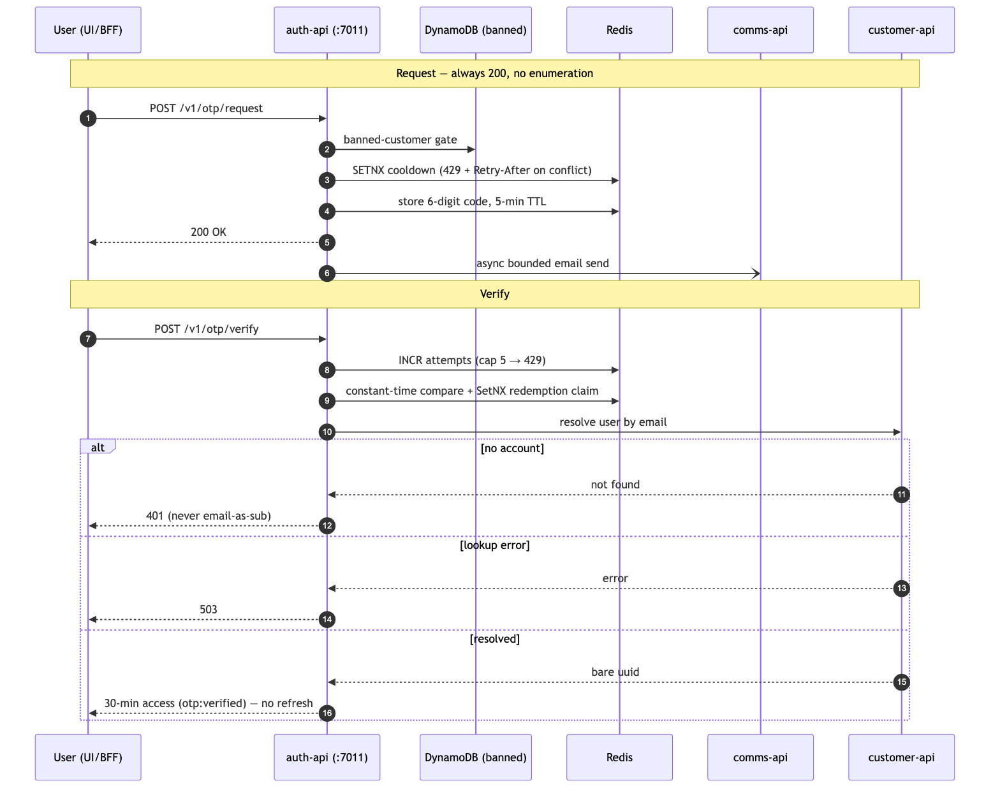
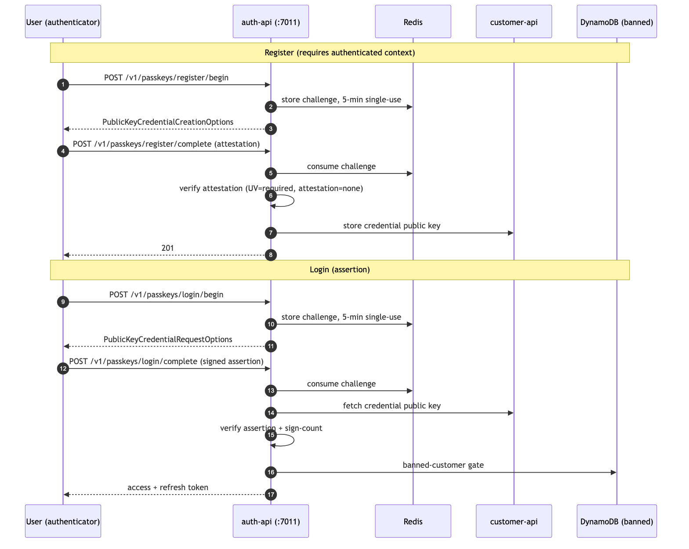
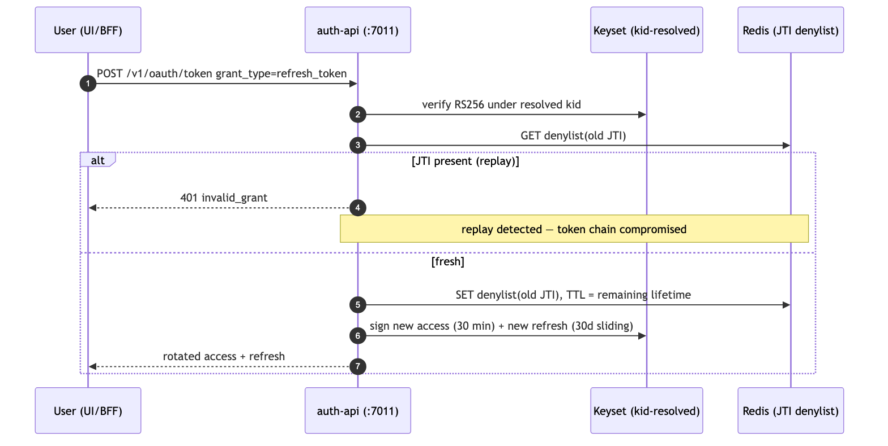
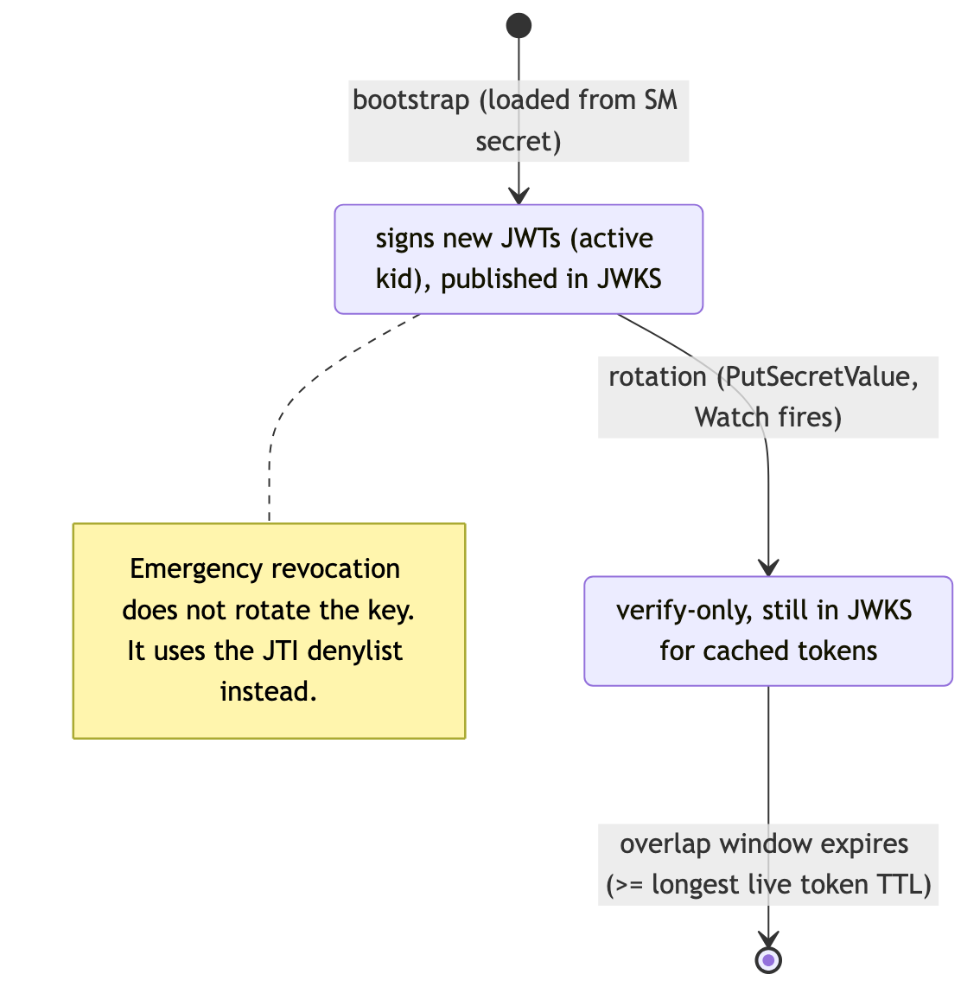

# High-Level Design — Komodo Auth API

> **Status:** Frozen for V1 — 2026-06-12. Updated 2026-06-22.
> **Companions:** `PRD.md` (scope + security posture) · `../openapi.yaml` (contract source of truth) · `DATA-MODEL.md` (state) · `adr/001-auth-token-verification.md` (verification pattern) · `adr/002-passkeys.md` (passkey ceremonies) · `adr/003-key-rotation.md` (key lifecycle) · `../README.md` (operations).

## 1. System Context

Auth-api is the **single token issuer** for Komodo. It is the only service that holds private signing key material; every other service is verify-only. Token *verification* is decentralized (ADR 001): consumers verify RS256 JWTs locally via forge-sdk `auth.JWKSVerifier` against the published JWKS, so auth-api sits on the **login/issuance path only** — it is not a per-request hop and not a request-time SPOF.

Guests never reach this system: the UI/BFF issues signed anonymous session cookies for guest UX state (PRD, decided 2026-06-12).

## 2. Trust Planes

| | Public (:7011) | Private (:7012) |
|---|---|---|
| Exposure | Internet, behind CloudFront + WAF | VPC private subnet only — never exposed |
| Callers | UI/BFF, future third parties | Komodo services |
| Surface | token, OTP, passkeys, revoke, JWKS, health | introspect, validate, client registry, health |
| Token profile issued | user tokens: `sub=<bare-uuid>`, user `aud`, user scopes (`otp:verified`, …) | M2M: `svc:<client_id>` scope, per-service `aud`, 1h TTL |
| Middleware posture | full hostile-traffic chain (verified, `cmd/public/main.go`): RequestID → Telemetry → RateLimiter → IPAccess → CORS → SecurityHeaders → Normalization → Sanitization → RuleValidation (per-route rules embedded from `internal/config/validation_rules.yaml`) | RequestID → Telemetry → ClientType → Auth (bearer + scope) on every route; sole documented exception: `/v1/token/validate` (the submitted token is the credential) |

**Plane-separation invariant:** a public-issued user token can never satisfy a private-plane check — private listeners require `svc:` scopes and service `aud` values that user tokens never carry. VPC isolation is defense-in-depth, never the only control.

The public middleware chain (`cmd/public/main.go`) is the **enterprise reference implementation** — other Komodo APIs adopt this chain and ordering.

## 3. Component View

| Component | Responsibility |
|---|---|
| `cmd/public`, `cmd/private` | Entrypoints; one image, `BUILD_TARGET`-selected binary; parallel dependency init, fail-fast on any init error; `-healthcheck` self-probe flag for shell-less images |
| `internal/api` | HTTP handlers: token grants, OTP, passkeys (3b), revoke, introspect, validate, JWKS, health |
| `internal/jwt` | Instance-based token authority: RS256 sign/verify, multi-`kid` keyset, `Signer` seam for the V2 KMS drop-in |
| `internal/oauth/clients` | Client registry: fail-closed scope checks, constant-time secret compare; being converted to injected `atomic.Pointer` + hot-reload (Phase 3) |
| `internal/db` | Redis-backed state: OTP lifecycle (SetNX cooldown, INCR-first attempts), JTI denylist, WebAuthn challenges (3b) |
| `internal/clients` | Outbound adapters: comms-api (async bounded email), customer-api (identity + passkey credentials), banned-customers (DynamoDB) |
| forge-sdk | `security/oauth`, `security/os/host` (core-dump guard), `secretsmanager` (+`Watch`), `db/redis`, `http/client`, logging/middleware |

## 4. Primary Flows

**M2M (`client_credentials`)** — service → public token endpoint (form or JSON) → registry validation (fail-closed scopes) → RS256 sign with active `kid`, `svc:<client_id>` scope, per-service `aud`, 1h TTL → snake_case RFC 6749 response. Consumers cache via `WithServiceAuth`. Auth-api self-mints its own downstream service tokens (issuer exception — documented at `getOrRefreshSvcJWT`).

**OTP login / email verification** — request: banned-customer gate → `SETNX` cooldown claim (429 + `Retry-After` on conflict) → 6-digit code, 5-min TTL → always 200 (no email enumeration) → bounded async email via comms-api. Verify: `INCR`-first attempt cap (5, then 429) → constant-time compare → single-use delete serialized by an atomic `SetNX` redemption claim (Phase 8a; no `GETDEL` dependency) → resolve `USER#<id>` via customer-api (lookup error → 503; no account → 401; **never** email-as-`sub`) → issue 30-min access (`otp:verified`), **no refresh token** (OTP is short-lived by decision 5B; passkey is the durable-session credential).

**Passkeys (V1, Phase 3b)** — register (authenticated context required): begin → challenge in Redis (5-min, single-use) → complete → verify attestation → store credential public key via customer-api. Login: begin → challenge → complete → verify assertion against customer-api-fetched public key → banned gate → issue standard user access + refresh. Ceremony parameters (RP ID/origins per env, attestation `none`, UV `required`, sign-count posture) are fixed in ADR 002.

**Refresh** — verify under correct `kid` → JTI denylist check (fail closed) → **rotate**: issue new refresh, revoke old JTI (replay detection) → new access token.

**Revoke / Introspect / Validate** — revoke (RFC 7009): always 200, JTI denylisted with TTL = remaining lifetime. Introspect (RFC 7662, private, authed): `{active:false}` semantics, revocation source of truth, documented fail-open on Redis error. Validate (private, deliberately unauthenticated): local verify + decode for services that need claims.

**JWKS** — `/.well-known/jwks.json` publishes every keyset key (active + verify-only) during rotation overlap; `Cache-Control ≤ 300s` (target); CloudFront-fronted in V2.

## 5. Key Management Lifecycle

Signing keys load from the Secrets Manager config blob, injected (never env-logged), and hot-reload via `secretsmanager.Watch`: on rotation the incoming key becomes **active** and the prior key slides to a verify-only **previous** slot (`internal/jwt`, atomic), so rotation is a `PutSecretValue`, not a deploy, and never invalidates live tokens (overlap window ≥ longest live token TTL; emergency procedure uses the JTI denylist). The single JSON keyset secret (N verify-only keys, `activeKid` inside the secret) is the accepted target shape — ADR 003, pending migration. Core dumps disabled (`host.DisableCoreDumps`). V2: signing moves behind `kms:Sign` via the existing `Signer` seam so the private key never materializes in-process.

## 6. State

All durable user data lives in customer-api. Auth-api state is ephemeral, TTL'd Redis plus two SM secrets and one DynamoDB read — full schema in `DATA-MODEL.md`.

## 7. External Dependencies & Failure Posture

| Dependency | Used for | On failure |
|---|---|---|
| Redis (ElastiCache) | OTP, challenges, JTI denylist | OTP/passkey flows 5xx; introspect documented fail-open; refresh fail-closed; M2M issuance unaffected |
| Secrets Manager | keyset, client registry, Redis creds | Boot: fail-fast exit. Runtime: `Watch` failure keeps last-good in memory |
| customer-api (private) | `USER#<id>` resolution, passkey credentials | OTP/passkey verify → 503 (lookup error) / 401 (no account) |
| comms-api | OTP email | Non-fatal: 200 returned, error logged (no enumeration oracle) |
| DynamoDB | banned-customers gate | Per-handler posture; gate precedes all user-token issuance |
| Consumers' JWKS fetch | decentralized verify | SDK caches by `kid` + one-shot refetch; auth-api downtime does not break verification of cached keys |

## 8. Deployment

- **V1:** ECS Fargate via CDK (`deploy/cdk/`) behind CloudFront + WAF; private port reachable only inside the VPC. Lambda rejected 2026-06-12 (breaks hot rotation, pooling, cold-start latency).
- Ports per enterprise allocation: 7011 public / 7012 private. Local parity via LocalStack + local Redis (`just up`).
- Image: distroless static, nonroot (Phase 3), binary `-healthcheck` probe.

## 9. Observability & Operations

Structured logs with strict redaction (no PII/tokens/keys/codes — IDs only, partially redacted); RequestID + Telemetry middleware on all routes including JWKS/ready (Phase 3). `/health` liveness + `/health/ready` with real dependency checkers (Redis, DynamoDB, downstream HTTP — Phase 3). Production launch (TODO Phase 7) adds: CloudWatch dashboards/alarms (issuance error rate + latency, OTP abuse signals, Redis health, 5xx), k6 measured baselines replacing the modeled latency table, and runbooks (rotation §4, emergency revocation).

## 10. Security Architecture (threat → control)

| Threat | Control |
|---|---|
| Stolen public token used against backend | Plane separation: `aud` + `svc:` scope checks; private listeners reject user tokens |
| Algorithm confusion / forged JWT | RS256 pinned at sign and verify; `kid`-resolved keys; single issuer |
| OTP brute force / replay | 5-attempt INCR-first cap, SetNX cooldown, 5-min single-use codes, constant-time compare, WAF rate limits |
| Email / client enumeration | OTP request always 200; revoke always 200; registry endpoints authed; timing-oracle fix sequenced with hashed secrets (Phase 3) |
| Refresh-token replay | Rotation-on-use + JTI denylist detection |
| Key exfiltration | Injected keyset, no env/logs, core dumps off, nonroot static image; V2 KMS removes in-process key entirely |
| Registry misconfiguration | Fail-closed scopes (empty ⇒ deny; explicit `"*"` only) |
| Credential-stuffing class | Does not exist: no passwords anywhere (passkeys + OTP only) |
| Banned actors | DynamoDB gate before any user-token issuance |

## 11. Open Design Work (gates implementation, not this HLD)

ADR 002 (passkey ceremony parameters + customer-api credential contract) is the only unwritten design artifact in the V1 critical path; it is the first deliverable of TODO Phase 3b. Fully-atomic single-use semantics for OTP codes and WebAuthn challenges are handled in-process via an atomic `SetNX` redemption claim (Phase 8a); forge-sdk `GETDEL`/`MGET` remain tracked only as ergonomic / one-RTT conveniences, not correctness blockers.
