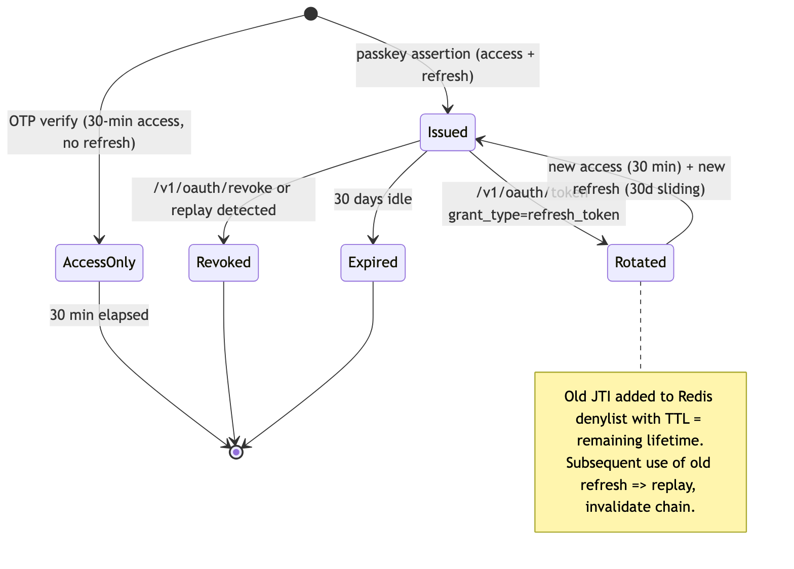

# PRD — Komodo Auth API

> **Status:** Frozen — V1 scope and all decisions locked 2026-06-12. Updated 2026-06-22. Changes require an explicit re-open by the owner (rad).
> **Contract:** `openapi.yaml` is the source of truth for request/response shapes. This PRD is the source of truth for scope and security posture. Implementation sequencing lives in `TODO.md`.

## Mission

The Auth API is the **sole authentication authority** for Komodo: the single token issuer, the only service holding a private signing key, and the gatekeeper for every authenticated HTTP request across UIs and backend services. It must be the most secure service in the company — every design decision resolves ties in favor of security, then latency, then cost.

## Goals

- Single issuer, verify-everywhere: this API mints all tokens; every other service verifies locally via JWKS (forge-sdk `auth.JWKSVerifier`) and never holds key material.
- Two hard-separated trust planes: **public** (internet-facing, UIs) and **private** (M2M, same-VPC). A token issued for the public plane must never satisfy a private-plane check.
- Passwordless-first user authentication: passkeys (WebAuthn) as the primary method, email OTP as the universal fallback and email-verification factor.
- Zero-downtime key rotation: signing keys rotate on the fly with no deploy and no invalidation of live tokens.
- Set the enterprise pattern: this is the reference implementation for middleware chains, test tiers, logging redaction, and service structure that all other Komodo APIs follow.

## Non-Goals (explicit)

- **Authorization / RBAC** — scope *enforcement* beyond token claims belongs to `komodo-access-api`. This API embeds scopes in tokens; it does not manage roles or permissions.
- **User profile and credential storage** — `komodo-customer-api` owns user records and passkey credential material; this API consumes it via HTTP adapter.
- **Basic Auth** — removed entirely (decision 2026-06-12). `client_credentials` JWTs cover M2M; a second credential path adds audit surface for zero gain.
- **Server-side session store** — this API manages token lifecycle (issue / refresh / revoke / introspect), not sessions. "Session" for an authenticated user *is* the refresh-token lifecycle. See Open Questions for guest sessions.
- **Social IdP federation (Google, Apple)** — V2, blocked on the `authorization_code` grant and login UI.
- **"API key management"** — not a feature; the OAuth client registry (clientId/clientSecret per service) is the only non-token credential surface.

## Trust & Token Model

| Property | Requirement |
|---|---|
| Signing | RS256 only (V1), single issuer; verification pinned to RS256. ES256/KMS evaluated in V2. |
| Plane separation | Public-issued tokens carry user-scoped `aud` + scopes; private (M2M) tokens carry per-service `aud` and a `svc:<client_id>` scope. Private listeners require `svc:` scopes — a hijacked public token cannot cross into the backend plane. |
| Subject | Every user token's `sub` is a bare UUID (no `USER#` prefix, no email-as-subject, no guest fallback; ratified Phase 5, 2026-06-16). `client_id` for M2M. |
| Client identity | Every app/service has a `clientId` (public identifier) + `clientSecret` (confidential credential, stored hashed — see TODO Phase 3). Secrets authenticate the client at the token endpoint; they are not encryption keys. |
| Revocation | JTI denylist in Redis, TTL = remaining token lifetime. Introspect is the revocation source of truth. Local-verify consumers accept the documented per-token-type revocation SLA (ADR 001). |
| Rotation | Multi-`kid` JWKS with overlap window; key sourced from Secrets Manager and hot-reloaded via `secretsmanager.Watch` — no deploy, no live-token invalidation. V2 moves signing behind `kms:Sign`. |
| Token store | Redis (ElastiCache, TLS in transit, network-restricted to this service). Local Redis for dev/V1 testing. Stores only OTPs, attempt counters, WebAuthn challenges, and JTI revocation records — no PII beyond keyed email for OTP TTL windows. |

### Token lifetimes (V1)

| Token | TTL |
|---|---|
| M2M access (`client_credentials`) | 1 hour |
| Refresh | 30 days **sliding** (decision 2026-06-12): rotated on every use (replay detection via JTI denylist), so active customers stay signed in; signed out after 30 days idle |
| User access (OTP- or passkey-issued) | 30 minutes (decision 2026-06-12 — raised from 5; balances local-verify revocation lag against refresh chatter) |
| OTP code / WebAuthn challenge | 5 minutes, single-use |

## Functional Requirements — V1

1. **OAuth2 token issuance** — `client_credentials` (M2M), `refresh_token` (with rotation), and `authorization_code` (PKCE-S256, Phase 8c — flag-gated via `ENABLE_AUTH_CODE_GRANT`, functional when enabled) grants; RFC 6749 form + JSON, snake_case responses.
2. **Passkey authentication (WebAuthn)** — *new in V1 (decision 2026-06-12)*:
   - Registration ceremony for users with a known account (requires an authenticated context — an OTP-verified or existing valid token).
   - Assertion ceremony issuing a user access + refresh token on success.
   - Credential public keys stored by customer-api (adapter extension); challenges in Redis with 5-min TTL, single-use.
3. **Email OTP** — request/verify as built: 6-digit, 5-min TTL, single-use, INCR-first attempt cap (5), SetNX cooldown, constant-time compare. Retained permanently as the fallback factor and email-verification mechanism — not removed in favor of passkeys.
4. **Token lifecycle** — revoke (RFC 7009), introspect (RFC 7662, private plane), validate (private plane, network-trust exception documented).
5. **JWKS publication** — `/.well-known/jwks.json`, multi-`kid` during rotation overlap, `Cache-Control ≤ 300s`.
6. **Client registry** — Secrets-Manager-sourced, hot-reloadable, fail-closed scope checks (empty `allowed_scopes` ⇒ deny), enumerable only with authenticated private-plane access.
7. **Banned-customer gate** — checked before any user-token issuance (OTP request wired; token paths per TODO).
8. **HTTP adapters** — comms-api (OTP email delivery, async, bounded, time-boxed) and customer-api (credential/identity resolution, passkey credential CRUD).

## Security Requirements (all planes)

- Public plane assumes hostile traffic: WAF + rate limiting + IP allow/deny + body-size caps + idempotency + request validation middleware, in the enterprise-standard chain order. Private plane keeps full authn (bearer + scope) on every route except the documented `validate` exception; VPC isolation is defense-in-depth, never the only control.
- Logging: no PII, no tokens, no keys, no OTP codes. Identifiers only, partially redacted where needed for triage (logging.md §6).
- Key material: injected, never in env vars or logs; core dumps disabled; nonroot minimal container image.
- Fail-closed by default; every deliberate fail-open (introspect Redis-error path, validate) is documented at the call site with rationale.
- 100% test coverage floor on auth-decision paths (`otp.go`, `oauth_token.go`, `oauth_introspect.go`, `banned.go`, passkey handlers when added); race detector in CI.

## Non-Functional Requirements

| Metric | Target |
|---|---|
| Token issuance latency | p50 ≤ 10ms, p99 ≤ 30ms (M2M); user-flow verify (OTP/passkey) p99 ≤ 100ms |
| Availability | 99.9% V1 (single-AZ EC2 accepted); 99.95%+ on Fargate (V2) |
| Token verification | Performed locally by consumers — auth-api is not on the request hot path and is not a per-request SPOF |
| Rotation | Key and client-secret rotation with zero deploys, zero dropped tokens |

Latency baselines are modeled, not measured (see TODO latency table); a k6 baseline gates any optimization work.

## Deployment

- **V1:** ECS Fargate via CDK (`deploy/cdk/`) — preserves long-lived processes required for hot rotation and pooled Redis connections. *Lambda was evaluated and rejected (2026-06-12): it breaks `secretsmanager.Watch` hot rotation, connection pooling, and cold-start latency targets — a rearchitecture, not a cost toggle.*
- Ports per enterprise allocation: public **7011**, private **7012**. Private port never exposed publicly.

## Dependencies

- `komodo-customer-api` — credential resolution (`GET /v1/me/credentials`), passkey credential storage (new V1 surface to be specified in its PRD).
- `komodo-communications-api` — OTP email delivery (`otp` template registration outstanding).
- ElastiCache Redis, Secrets Manager (V2: KMS), DynamoDB banned-customers table.
- `ui/` — snake_case token responses; guest-OTP assumptions removed (TODO Phase 5).

## Roadmap

- **V1 — launch:** everything in Functional Requirements above + TODO Phases 0–6 hardening. Definition of done: full passkey + OTP + M2M flows green against LocalStack; security phases complete.
- **V2 — hardening + reach:** KMS-backed signer; social IdP federation (Google/Apple) via `authorization_code` + login UI; device/user MFA (OTP as second factor, wraps passkey flows); bloom-filter JTI denylist; CloudFront-fronted JWKS; Fargate; refresh-token device binding.
- **V3 — performance/security ceiling:** Rust (Axum) rewrite evaluation; ES256 migration.

## Guest Sessions (decided 2026-06-12)

Guests never touch the Auth API. The **UI/BFF issues signed anonymous session cookies** for guest UX state (cart continuity); guest backend traffic rides the public plane under WAF/rate-limit protection keyed by the BFF session ID. The Auth API mints tokens only for resolved identities (`sub = <bare-uuid>`). If verifiable guest tokens later prove necessary, V2 may add a dedicated low-TTL `guest` grant (`sub = GUEST#<uuid>`, severely restricted `aud`/scopes) — deferred, not designed. The `ui/` repo carries the guest-cookie work item.

## Risks

- Passkeys-in-V1 adds a cross-repo dependency (customer-api credential storage) and new ceremony endpoints to the launch surface — the largest V1 schedule risk.
- Redis is the single stateful dependency; OTP/passkey/revocation flows degrade without it (documented fail-open/fail-closed posture per endpoint).
- Compliance trajectory (SOC2, PCI-DSS) requires the logging/redaction and coverage floors to hold as the enterprise pattern propagates.
